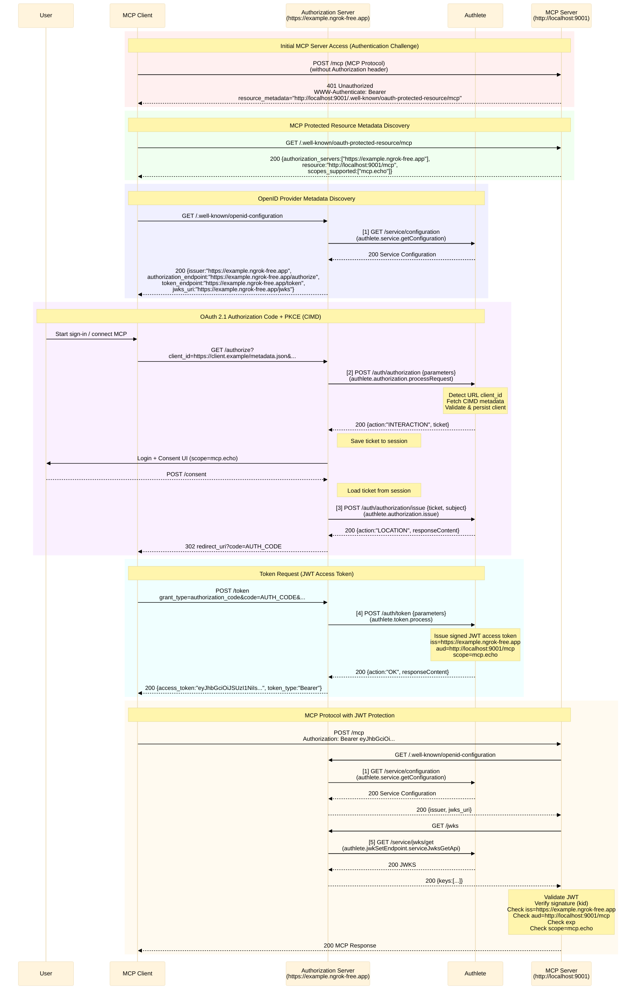

# Implementing the Authorization Server

## Libraries Used

This hands-on session uses the beta release of [@authlete/typescript-sdk](https://github.com/authlete/authlete-typescript-sdk).
The web server uses [hono](https://hono.dev/), but you may use any familiar framework such as express.

Example usage of [@authlete/typescript-sdk](https://github.com/authlete/authlete-typescript-sdk):

```ts
import { Authlete } from "@authlete/typescript-sdk";

const authlete = new Authlete({
  bearer: process.env["AUTHLETE_BEARER"] ?? "",
});

async function run() {
  const result = await authlete.service.get({
    serviceId: "<id>",
  });

  console.log(result);
}
```

This sample already includes the Authlete SDK and creates the instance by loading the following environment variables from [.env.example](/.env.example).

```conf
# Authlete Settings
AUTHLETE_BASE_URL=https://jp.authlete.com
AUTHLETE_SERVICE_APIKEY=your_authlete_service_apikey_here # Replace with your Authlete service API key
AUTHLETE_SERVICE_ACCESSTOKEN=your_authlete_service_accesstoken_here # Replace with your Authlete service access token
```

Initialization is done in the [getAuthlete](/apps/oauth-server/src/authlete.ts) method.
This instance is already added to the hono context, so each handler should obtain it from the context. Details are described later.

## Endpoints to Implement

The OAuth/OIDC endpoints to implement are as follows.

| No. | Method | Path | Name | Description | Authlete API path | Authlete TypeScript SDK method | Documentation |
| --- | --- | --- | --- | --- | --- | --- | --- |
| [1] | GET | `/.well-known/openid-configuration` | OpenID Discovery endpoint | Endpoint that publishes server metadata | `GET /api/{serviceId}/service/configuration` | `authlete.service.getConfiguration({ serviceId })` | https://docs.authlete.com/en/shared/latest#get-/api/-serviceId-/service/configuration |
| [2] | GET/POST | `/authorize` | Authorization endpoint | Endpoint that handles authorization requests from client applications | `POST /api/{serviceId}/auth/authorization` | `authlete.authorization.processRequest({ serviceId, authorizationRequest })` | https://docs.authlete.com/en/shared/latest#post-/api/-serviceId-/auth/authorization |
| [3] | POST | `/consent` | User consent result endpoint | Endpoint that receives user consent and issues an authorization code | `POST /api/{serviceId}/auth/authorization/issue` | `authlete.authorization.issue({ serviceId, authorizationIssueRequest })` | https://docs.authlete.com/en/shared/latest#post-/api/-serviceId-/auth/authorization/issue |
| [4] | POST | `/token` | Token endpoint | Endpoint that handles token requests from client applications | `POST /api/{serviceId}/auth/token` | `authlete.token.process({ serviceId, tokenRequest })` | https://docs.authlete.com/en/shared/latest#post-/api/-serviceId-/auth/token |
| [5] | GET | `/jwks` | JWK Set endpoint | Endpoint that publishes public keys in JWKS format for token signature verification | `GET /api/{serviceId}/service/jwks/get` | `authlete.jwkSetEndpoint.serviceJwksGetApi({ serviceId })` | https://docs.authlete.com/en/shared/latest#get-/api/-serviceId-/service/jwks/get |

Each endpoint internally calls the Authlete API shown in the table to implement the authorization process. The authorization server parses Authlete responses, applies authorization-server-specific customization, and returns the result to the client.

For error responses (for example, when a user denies consent), use the following API outside the numbering.

| Authlete API path | Summary | Authlete TypeScript SDK method | Documentation |
| --- | --- | --- | --- |
| `POST /api/{serviceId}/auth/authorization/fail` | Generates an OAuth/OIDC error response when authorization fails (for example, user denial or unsupported `prompt=none`) | `authlete.authorization.fail({ serviceId, authorizationFailRequest })` | https://docs.authlete.com/en/shared/latest#post-/api/-serviceId-/auth/authorization/fail |

## Flow Diagram

The following shows the end-to-end flow implemented in this workshop. Sections labeled `🛠️【Implementation Target】` are the parts you implement in this workshop.
The numbering corresponds to `Endpoints to Implement`, so use it to map each flow part to methods and documentation.



## Implementation Approach

The file [index.ts](/apps/oauth-server/src/index.ts) contains stub implementations for each endpoint. In this hands-on, you will implement each endpoint. The `/authorize` endpoint includes a sample SDK call as a starting point.

The implementation flow is:

1. Get the Authlete SDK instance (`authlete`) and `serviceId` from the hono context.
2. Parse the client request and extract required information such as headers, query parameters, and body.
3. Call the Authlete API through the Authlete SDK using the extracted information.
4. Parse the Authlete API response and return a response to the client.

### OpenID Discovery Endpoint

The simplest Authlete server call in this workshop is the OpenID Discovery endpoint.
When `/.well-known/openid-configuration` is called, the authorization server calls Authlete's `service/configuration` API and returns the response as-is.

```ts
app.get('/.well-known/openid-configuration', async (c: Context) => {
    // Get authlete instance and serviceId from context
    const { authlete, serviceId } = c.var;
    // Call Authlete API
    const config = await authlete.service.getConfiguration({
        serviceId
    })
    // Return the response as-is
    return c.json(config)
});
```

The same applies to the `jwks` endpoint.

### Other Endpoints

Authorization and token endpoints are slightly more complex than OpenID Discovery.
Authlete returns the request analysis result to the authorization server, including an `action` value that indicates what the authorization server should do next. Implement handling based on each returned `action`.

[Basic concepts for handling responses from Authlete APIs - Authlete](https://www.authlete.com/kb/getting-started/implementing-an-authorization-server/handling-responses-from-authlete-apis/)

Refer to each API document for details on parsing Authlete API responses.

For example, the authorization endpoint may return `action: INTERACTION`. This means you should show an interactive consent screen (if the user has not yet consented), so render and return the consent UI.

```ts
app.get('/authorize', async (c: Context) => {
  console.log('GET /authorize called');

  // implement authorization endpoint logic here
  const { authlete, serviceId } = c.var;
  const { search } = new URL(c.req.url);
  const parameters = search.startsWith('?') ? search.slice(1) : '';
  const authorizationRequest: AuthorizationRequest = {
    parameters
  };
  const response: AuthorizationResponse = await authlete.authorization.processRequest({
    serviceId: serviceId,
    authorizationRequest
  });

  const responseContent = response.responseContent ?? '';
  c.header('Cache-Control', 'no-store');
  c.header('Pragma', 'no-cache');

  // Generate a response based on actions from Authlete
  switch (response.action) {
    case 'INTERNAL_SERVER_ERROR':
      c.header('Content-Type', 'application/json');
      return c.body(responseContent, 500);
    case 'BAD_REQUEST':
      c.header('Content-Type', 'application/json');
      return c.body(responseContent, 400);
    case 'LOCATION':
      if (responseContent) {
        return c.redirect(responseContent);
      }
      c.header('Content-Type', 'application/json');
      return c.body('', 500);
    case 'FORM':
      c.header('Content-Type', 'text/html; charset=UTF-8');
      return c.body(responseContent, 200);
    case 'INTERACTION':
      // Save required info such as ticket in session
      const authorizationSession = response.ticket
        ? {
          ticket: response.ticket,
          scopesToConsent: response.scopes
            ?.map((scope) => scope.name)
            .filter((scope): scope is string => Boolean(scope)) ?? [],
        }
        : undefined;
      await c.var.session.update((prev) => ({
        ...prev,
        authorization: authorizationSession,
      } satisfies AuthorizationSession));
      // Render consent UI
      return renderConsent(c, response);
    case 'NO_INTERACTION':
      const errorResponse = await authlete.authorization.fail({
        serviceId,
        authorizationFailRequest: {
          ticket: response.ticket!,
          reason: 'SERVER_ERROR',
          description: 'prompt=none is not supported in this sample server'
        }
      });
      return handleFailAction(c, errorResponse);
    default:
      c.header('Content-Type', 'application/json');
      return c.body('', 500);
  }
});
```

> Note: For client ID display logic, refer to CIMD documentation: [Client Properties](https://www.authlete.com/developers/cimd/#client_properties). You can generally use the `resolveClientId` function in [/apps/oauth-server/src/samples/handlers.ts](/apps/oauth-server/src/samples/handlers.ts) as-is.

In this workshop, user authentication itself is not implemented, so we assume the following demo user is already authenticated.
Also, claims shown below are added to the access token because specific claims are required by MCP server tools used later.

```ts
const demoUser: User = {
    id: 'demo-user',
    claims: {
        family_name: 'Demo',
        given_name: 'Authlete',
        preffered_username: "Authlete Demo User"
    },
    consentedScopes: [],
};
```

## Sample Implementation

To support development, a SPA (Single Page Application) that gets a token with Authorization Code flow is provided at `/sample-client`. Your first goal is to make token acquisition work with this client.

Sample endpoint implementations are included in [/apps/oauth-server/src/samples/handlers.ts](/apps/oauth-server/src/samples/handlers.ts). Use them as reference when needed. You can also build a working demo server by wiring handlers as follows.

```ts
import {
  authorizeHandler,
  consentHandler,
  jwksHandler,
  openIdConfigHandler,
  tokenHandler,
} from './samples/handlers';

app.get('/authorize', authorizeHandler);
app.post('/authorize', authorizeHandler);
app.post('/consent', consentHandler);
app.post('/token', tokenHandler);
app.get('/jwks', jwksHandler);
app.get('/.well-known/openid-configuration', openIdConfigHandler);
```

If implementing your own logic is difficult, use the handlers above to verify behavior.

## Obtaining a Token with the Sample Client

After implementation, access http://localhost:9000/sample-client and send an authorization request.
Click `Start authorization` to send the request. If the authorization endpoint returns a correct authorization code response and token exchange works through `Exchange code`, implementation is complete.

Decode the token with https://jwt.io and inspect the payload. Verify that parameters requested at authorization time and user claims embedded by the authorization server are included.

## Publish over HTTPS

In `/sample-client`, authorization and token endpoints are hard-coded as relative paths such as `/authorize` and `/token`.
For MCP client integration, however, you need to provide endpoint metadata including `jwks_uri`.

Endpoint metadata values are reflected from your Authlete service settings, but from a security perspective these endpoints can only be configured with HTTPS. Therefore, an authorization server that uses Authlete as backend must be hosted over HTTPS. *

You can publish over HTTPS using self-signed certificates (`mkcert`), deployment platforms, or tunnel/proxy services such as `ngrok`. In this workshop, `ngrok` is used to minimize environment-specific differences.

After setting up ngrok as described in README, run `ngrok http 9000`.
Copy the URL shown in Forwarding and apply it to the following locations.

1. `OAUTH_SERVER_ISSUER` in `.env`
2. Endpoint settings in the target service on the Authlete console

| Property in metadata | Setting location | Value to set |
| -------------------- | ---------------- | ------------ |
| issuer | [Basic Settings] > [Advanced Settings] > [Issuer Identifier] | `OAUTH_SERVER_ISSUER` |
| authorization_endpoint | [Endpoints] > [Authorization] > [General] > [Authorization Endpoint URL] | `OAUTH_SERVER_ISSUER`/authorize |
|token_endpoint| [Endpoints] > [Token] > [General] > [Token Endpoint URL] | `OAUTH_SERVER_ISSUER`/token |
|jwks_uri| [Key Management] > [JWK Set] > [Authorization Server] > [JWK Set Endpoint URI] | `OAUTH_SERVER_ISSUER`/jwks |

3. In the Authlete console sample client, add `OAUTH_SERVER_ISSUER`/sample-client to [Endpoints] > [Basic Settings] > [General] > [Redirect URI]

After updating all settings, restart the development server with `npm run dev`.

Access `OAUTH_SERVER_ISSUER`/.well-known/openid-configuration and confirm that `issuer`, `authorization_endpoint`, `token_endpoint`, and `jwks_uri` are updated to your configured values.

Also access `OAUTH_SERVER_ISSUER`/sample-client and confirm token acquisition works successfully.

> * As a development workaround, you could rewrite metadata responses (for example `authorization_endpoint`) to `http`, but this workshop intentionally proceeds with HTTPS publishing.

Authorization server implementation is now complete.

## Next Step

[Verify integration with VS Code](./03-call-mcp-tool-via-vscode.md)
