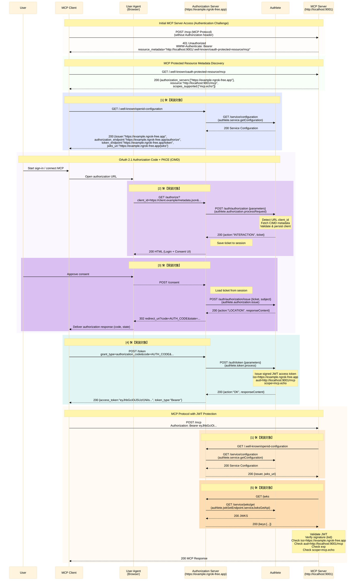

# 認可サーバーの実装

## 利用ライブラリ

ハンズオンでは beta リリースされている [@authlete/typescript-sdk](https://github.com/authlete/authlete-typescript-sdk) を利用します。
Web サーバーには [hono](https://hono.dev/) を利用していますが、express など、使慣れたフレームワークで実装しても構いません。

[@authlete/typescript-sdk](https://github.com/authlete/authlete-typescript-sdk) の利用例は以下の通りです。

```ts
import { Authlete } from "@authlete/typescript-sdk";

const authlete = new Authlete({
  bearer: process.env["AUTHLETE_BEARER"] ?? "",
});

async function run() {
  const result = await authlete.service.get({
    serviceId: "<id>",
  });

  console.log(result);
}
```

このサンプルにはすでに Authlte SDK が組み込まれており、[.env.example](/.env.example) で示した以下の環境変数から、必要なデータを読みとりインスタンスを生成します。

```conf
# Authlete Settings
AUTHLETE_BASE_URL=https://jp.authlete.com
AUTHLETE_SERVICE_APIKEY=your_authlete_service_apikey_here # Replace with your Authlete service API key
AUTHLETE_SERVICE_ACCESSTOKEN=your_authlete_service_accesstoken_here # Replace with your Authlete service access token
```

インスタンスの初期化は [getAuthlete](/apps/oauth-server/src/authlete.ts) メソッド内で実施しています。
このインスタンスは hono の context に追加済みなので、各 Handler では context からインスタンスを取得してください。詳しくは後述します。

## 実装するエンドポイント

実装する OAuth/OIDC のエンドポイントは以下の通りです。

| No. | Method | Path | Name | Description | Authlete API path | Authlete Typescript SDK メソッド | ドキュメント |
| --- | --- | --- | --- | --- | --- | --- | --- |
| [1] | GET | `/.well-known/openid-configuration` | OpenID Discovery エンドポイント | サーバーメタデータを公開するエンドポイント | `GET /api/{serviceId}/service/configuration` | `authlete.service.getConfiguration({ serviceId })` | https://docs.authlete.com/en/shared/latest#get-/api/-serviceId-/service/configuration |
| [2] | GET/POST | `/authorize` | 認可エンドポイント | クライアントアプリケーションの認可リクエストを処理するエンドポイント | `POST /api/{serviceId}/auth/authorization` | `authlete.authorization.processRequest({ serviceId, authorizationRequest })` | https://docs.authlete.com/en/shared/latest#post-/api/-serviceId-/auth/authorization |
| [3] | POST | `/consent` | ユーザー同意結果取得エンドポイント | ユーザーの同意結果を取得し、認可コードを発行するエンドポイント | `POST /api/{serviceId}/auth/authorization/issue` | `authlete.authorization.issue({ serviceId, authorizationIssueRequest })` | https://docs.authlete.com/en/shared/latest#post-/api/-serviceId-/auth/authorization/issue |
| [4] | POST | `/token` | トークンエンドポイント | クライアントアプリケーションのトークンリクエストを処理するエンドポイント | `POST /api/{serviceId}/auth/token` | `authlete.token.process({ serviceId, tokenRequest })` | https://docs.authlete.com/en/shared/latest#post-/api/-serviceId-/auth/token |
| [5] | GET | `/jwks` | JWK セットエンドポイント | トークン署名検証用の公開鍵を JWKS 形式で公開するエンドポイント | `GET /api/{serviceId}/service/jwks/get` | `authlete.jwkSetEndpoint.serviceJwksGetApi({ serviceId })` | https://docs.authlete.com/en/shared/latest#get-/api/-serviceId-/service/jwks/get |

各エンドポイントとでは、内部的に Authlete API の列に示した API を呼び出し、認可処理を実装します。認可サーバーは Authlete からの応答を解析し、認可サーバー独自のカスタマイズを実施したうえで、クライアントに結果を返却します。

ユーザーが同意をキャンセルした場合など、エラー応答を返却したい場合、採番対象外として以下の API を利用します。

| Authlete API path | 概要 | Authlete Typescript SDK メソッド | ドキュメント |
| --- | --- | --- | --- |
| `POST /api/{serviceId}/auth/authorization/fail` | 認可失敗（ユーザー拒否、`prompt=none` 非対応など）時に、OAuth/OIDC エラー応答を生成する | `authlete.authorization.fail({ serviceId, authorizationFailRequest })` | https://docs.authlete.com/en/shared/latest#post-/api/-serviceId-/auth/authorization/fail |


## フロー図

今回実装する全体のフローを記載します。🛠️【実装対象】と記載がある部分が今回のワークショップで実装する箇所です。
上述の実装するエンドポイントの採番に対応していますので、対応するメソッドとドキュメントの確認に利用してください。



## 具体的な実装方針

[index.ts](/apps/oauth-server/src/index.ts) に、各エンドポイントの空実装があります。ハンズオンでは、各エンドポイントを実装していきます。`/authorize` エンドポイントに実装のための足掛かりとして、SDK の呼び出し例を記載しています。

実装方針としては以下の通りです。

1. hono のコンテキストから Authlete SDK のインスタンス (authlete) と serviceId を取得します
1. クライアントからのリクエストを解析し、ヘッダー、クエリパラメータ、Body など必要な情報を取得します
1. 上記情報をもとに、Authlete SDK を利用し Authlete API を呼び出します
1. Authlete API の応答を解析し、クライアントにレスポンスを応答します

```ts
app.get('/authorize', async (c: Context) => {
  console.log('GET /authorize called');

  // implement authorization endpoint logic here
  const { authlete, serviceId } = c.var;
  const { search } = new URL(c.req.url);
  const parameters = search.startsWith('?') ? search.slice(1) : '';
  const authorizationRequest: AuthorizationRequest = {
    parameters
  };
  const response: AuthorizationResponse = await authlete.authorization.processRequest({
    serviceId: serviceId,
    authorizationRequest
  });

  const responseContent = response.responseContent ?? '';
  c.header('Cache-Control', 'no-store');
  c.header('Pragma', 'no-cache');

  // Authlete からのアクションをもとに応答を生成する
  switch (response.action) {
    case 'INTERNAL_SERVER_ERROR':
      c.header('Content-Type', 'application/json');
      return c.body(responseContent, 500);
    case 'BAD_REQUEST':
      c.header('Content-Type', 'application/json');
      return c.body(responseContent, 400);
    case 'LOCATION':
      if (responseContent) {
        return c.redirect(responseContent);
      }
      c.header('Content-Type', 'application/json');
      return c.body('', 500);
    case 'FORM':
      c.header('Content-Type', 'text/html; charset=UTF-8');
      return c.body(responseContent, 200);
    case 'INTERACTION':
      // ticket など必要な情報をセッションに保存する
      const authorizationSession = response.ticket
        ? {
          ticket: response.ticket,
          scopesToConsent: response.scopes
            ?.map((scope) => scope.name)
            .filter((scope): scope is string => Boolean(scope)) ?? [],
        }
        : undefined;
      await c.var.session.update((prev) => ({
        ...prev,
        authorization: authorizationSession,
      } satisfies AuthorizationSession));
      // 同意画面を生成する
      return renderConsent(c, response);
    case 'NO_INTERACTION':
      const errorResponse = await authlete.authorization.fail({
        serviceId,
        authorizationFailRequest: {
          ticket: response.ticket!,
          reason: 'SERVER_ERROR',
          description: 'prompt=none is not supported in this sample server'
        }
      });
      return handleFailAction(c, errorResponse);
    default:
      c.header('Content-Type', 'application/json');
      return c.body('', 500);
  }
});
```

Authlete API の応答をどのように解析する必要があるかについては各 API ドキュメントを参照します。
基本的には Authlete API のレスポンスに含まれる action パラメーターの値に従い、応答を生成します。

[Authlete API からのレスポンスの処理に関する基本的な考えかた - Authlete](https://www.authlete.com/ja/kb/getting-started/implementing-an-authorization-server/handling-responses-from-authlete-apis/)

今回の実装ではユーザー認証は実装しないため、以下のデモユーザーで認証済みである前提で進めます。
また、アクセストークンのクレームには claims で示したクレームを追加します。これは後ほど連携する MCP サーバーの Tool で特定のクレームが必要となるためです。

```ts
const demoUser: User = {
    id: 'demo-user',
    claims: {
        family_name: 'Demo',
        given_name: 'Authlete',
        preffered_username: "Authlete Demo User"
    },
    consentedScopes: [],
};
```

## サンプル実装

開発の補助として認可コードフローでトークンを取得する SPA (Single Page Application) を `/sample-client` に実装しています。最初の目標はこのクライアントで正常にトークンを取得できるようになることです。

各エンドポイントのサンプル実装は [/apps/oauth-server/src/samples/handlers.ts](/apps/oauth-server/src/samples/handlers.ts) に含まれています。困った際の参照として利用ください。また、実際に以下のようにサンプルに含まれる Handler を指定することで、動作するデモサーバーを実装出来ます。

```ts
import {
  authorizeHandler,
  consentHandler,
  jwksHandler,
  openIdConfigHandler,
  tokenHandler,
} from './samples/handlers';

app.get('/authorize', authorizeHandler);
app.post('/authorize', authorizeHandler);
app.post('/consent', consentHandler);
app.post('/token', tokenHandler);
app.get('/jwks', jwksHandler);
app.get('/.well-known/openid-configuration', openIdConfigHandler);
```

ご自身での実装が難しい場合には、上記の Handler を利用して動作を確認してください。

## サンプルクライアントでのトークン取得

実装が完了したら http://localhost:9000/sample-client にアクセスを行い、認可リクエストを送信してみましょう。
`Start authorization` ボタンをクリックすると、認可リクエストが送信されます。認可エンドポイントから正しく認可コード応答が返り、`Exchange code` ボタンでトークンの交換ができれば完了です。

https://jwt.io などでトークンをでコードし、ペイロードを確認してみましょう。認可リクエストで指定したパラメーターや、認可サーバーで埋め込んだユーザークレームが含まれていることを確認してください。

## HTTPS での公開

`/sample-client` では認可エンドポイントやトークンエンドポイントを `/authorize` や `/token` など、決め打ちで相対パスを指定しています。
一方で MCP クライアントとの接続ではメタデータを通じてエンドポイントや jwks_uri を提供する必要があります。

メタデータ内の認可エンドポイントなどはサービスの各種設定がそのまま反映されますが、セキュリティの観点からこれらのエンドポイントは https のみが指定できます。したがって Authlete をバックエンドに利用している認可サーバー自身は、https でホストする必要があります。※

HTTPS で公開する方法については `mkcert` などで自己署名証明書を利用する、何らかのホスティングサービスにデプロイする、`ngrok` などのプロキシサービスを通じて公開するといった方法がありますが、今回は環境ごとの差異が生じにくい `ngrok` を使った方法を利用します。

README にある通りに ngrok のセットアップを実施後に、`ngrok http 9000` コマンドを実行します。
Forwarding に表示された URL をコピーし、以下の個所に反映させます。

1. `.env` の `OAUTH_SERVER_ISSUER`
2. Authlete コンソールの対象サービス内の各種エンドポイント設定

| メタデータ内のプロパティ | 設定箇所 | 設定する値 |
| ---------------------- | ------- | --------- |
| issuer | [基本設定] > [詳細設定]> [発行者識別子] | `OAUTH_SERVER_ISSUER` |
| authorization_endpoint | [エンドポイント] > [認可] > [一般] > [認可エンドポイントURL] | `OAUTH_SERVER_ISSUER`/authorize |
|token_endpoint| [エンドポイント] > [トークン] > [一般] > [トークンエンドポイントURL] | `OAUTH_SERVER_ISSUER`/token |
|jwks_uri| [キーマネージメント] > [JWK Set] > [認可サーバー] > [JWKセットエンドポイントのURI] | `OAUTH_SERVER_ISSUER`/jwks |

3. Authlete コンソールのサンプルクライアント [エンドポイント] > [基本設定] > [一般] > [リダイレクトURI] に `OAUTH_SERVER_ISSUER`/sample-client を追加

全ての設定が終わったら、`npm run dev` コマンドで開発用サーバーを再起動します。

`OAUTH_SERVER_ISSUER`/.well-known/openid-configuration にアクセスをし、`issuer` `authorization_endpoint`, `token_endpoint`, `jwks_uri` が設定した値に更新されていることを確認します。

また、`OAUTH_SERVER_ISSUER`/sample-client にアクセスしトークン取得が正常に実施できることを確認します。

> ※開発中のワークアラウンドとしてメタデータの応答 (例えば authorization_endpoint) を編集し、http スキーマに書き換えるといった手法もありますが、今回は素直に HTTPS での公開をします。

認可サーバーの実装はこれで完了です。

## 次の手順

[VS Code との連携確認](./03-call-mcp-tool-via-vscode.md)
